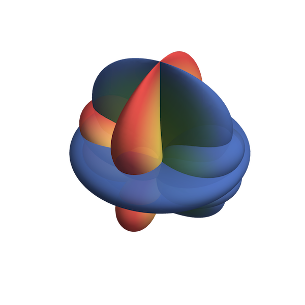

The SpinWeightedSpheroidalHarmonics package for Mathematica provides functions for computing
spin-weighted spheroidal harmonics, spin-weighted spherical harmonics and their associated eigenvalues.
Support is included for both arbitrary-precision numerical evaluation, and for series expansions.

## Getting the package

The latest development version will always be available from the project git
repository:

```bash
git clone https://github.com/BlackHolePerturbationToolkit/SpinWeightedSpheroidalHarmonics.git
```


## Requirements

The SpinWeightedSpheroidalHarmonics package requires a recent version of Mathematica. It is typically
tested with only the latest available version.


## Installation

Clone the repository and place it somewhere on Mathematica's $Path.
Typical locations are inside ${HOME}/.Mathematica/Applications/ for Linux or
inside ${HOME}/Library/Mathematica/Applications/ for Mac OSX.


## Usage

The package may be loaded into Mathematica using the command:

```Mathematica
<< SpinWeightedSpheroidalHarmonics`
```


## Examples

Examples are included in the documentation. See the
SpinWeightedSpheroidalHarmonics page in Documentation Center.


## Known problems

Known bugs are recorded in the project [bug tracker](https://github.com/BlackHolePerturbationToolkit/SpinWeightedSpheroidalHarmonics/issues).


## License

This code is distributed under the University of Illinois/NCSA
Open Source License. Details can be found in the LICENSE file.


## Authors

Barry Wardell  
Niels Warburton  
Marc Casals  
Sarp Akcay  


## Citation Guideline

If you make use of any of the Toolkit in your research please acknowledge using:

> This work makes use of the Black Hole Perturbation Toolkit.
